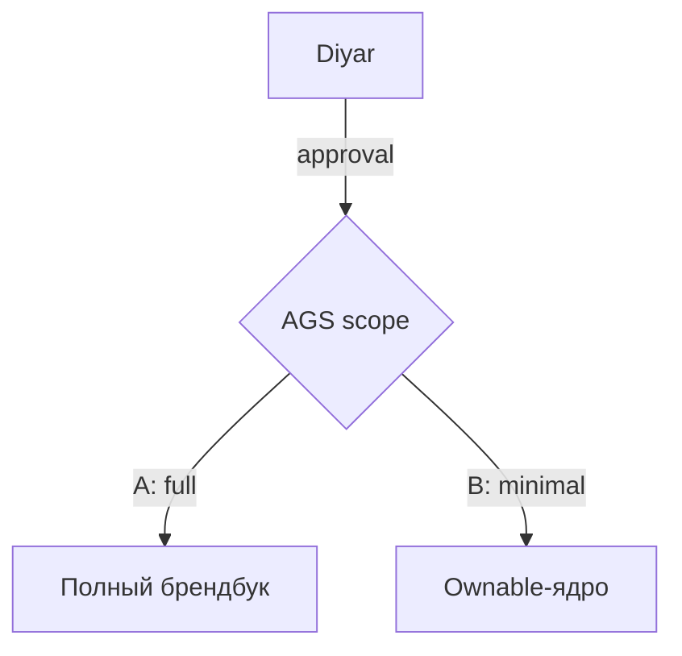

# Obsidian Markdown Conventions

Конвенции записи в vault `brain` поверх стандартного CommonMark/GFM. Базируются на официальном [obsidian-skills](https://github.com/kepano/obsidian-skills) от Steph Ango (CEO Obsidian, kepano), адаптированы под наш append-driven workflow и стек `obsidian-rest` (см. [[Memory Sync Protocol]]).

Цель: Claude пишет в vault на родном языке Obsidian — wikilinks, callouts, embed'ы, block-ID, properties — а не на «голом» Markdown. Это убирает ручную доработку файлов и делает граф vault'а связным.

Стандартный Markdown (заголовки, списки, bold/italic, code blocks, таблицы, цитаты) — **assumed knowledge**, здесь не дублируется. Покрываем только Obsidian-specific.

## 1. Wikilinks (внутренние ссылки)

Внутри vault — **только wikilinks**, никогда `[text](path)`. Obsidian отслеживает rename автоматически.

| Синтаксис | Назначение |
|-----------|-----------|
| `[[Note]]` | Ссылка на заметку |
| `[[Note\|Текст]]` | Кастомная подпись |
| `[[Note#Heading]]` | На конкретный заголовок |
| `[[Note#^block-id]]` | На конкретный блок |
| `[[#Heading]]` | Внутри того же файла |

Внешние URL — стандартный `[текст](url)`.

**Применение в vault:**
- В `Projects/*` ссылки между связанными проектами: `[[Ecole Ducasse Almaty Studio]]`
- В Sync Logs ссылки на проекты, фреймворки и предыдущие логи: `[[2026-04-26]]`
- В Index — only wikilinks, чтобы при rename ничего не сломалось

## 2. Block-IDs

Привязка ссылки к конкретному параграфу — `^id` в конце:

```markdown
Решение Дияра по варианту A vs B — ожидается. ^ags-decision-pending
```

Для списков и цитат — на отдельной строке после блока:

```markdown
> Бренд AGS вопрос практически решённый
> — Дияр, 2026-04-25
^diyar-quote-2026-04-25
```

Ссылка: `[[AGS Brand Development#^ags-decision-pending]]`.

**Применение:** changelog-entries в проектах получают block-ID — это даёт стабильные deep-link на конкретное событие из Sync Log или Index, переживающий любые правки секции.

## 3. Embeds

Префикс `!` перед wikilink — embed inline:

| Синтаксис | Назначение |
|-----------|-----------|
| `![[Note]]` | Вся заметка inline |
| `![[Note#Heading]]` | Только секция |
| `![[image.png]]` | Картинка |
| `![[image.png\|300]]` | Картинка с шириной 300px |
| `![[doc.pdf#page=3]]` | Страница PDF |

**Применение:** в Sync Log дня можно embed'ить changelog-секцию проекта — `![[AGS Brand Development#Changelog]]` — вместо копипасты. Один источник правды.

## 4. Callouts

Семантические блоки. Базовый синтаксис:

```markdown
> [!note]
> Базовое примечание.

> [!warning] Кастомный заголовок
> Тело callout'а.

> [!faq]- Свернут по умолчанию
> `-` — collapsed, `+` — expanded.
```

Полезные типы для нашего vault:

| Тип | Когда использовать |
|-----|--------------------|
| `note` | Нейтральная пометка |
| `tip` | Эвристика, лайфхак |
| `info` | Контекстная справка |
| `warning` | Возможная проблема, риск |
| `danger` | Критический риск, нельзя пропустить |
| `success` | Завершённый артефакт, подтверждённое решение |
| `failure` | Проваленный эксперимент, отвергнутая гипотеза |
| `question` | Открытый вопрос на стейкхолдера |
| `quote` | Цитата стейкхолдера дословно |
| `bug` | Известный баг тулинга |
| `example` | Worked example |
| `abstract` | TL;DR в начале длинной заметки |
| `todo` | Action item внутри тела |

**Применение в vault:**
- Цитаты Дияра/Эрика/Emelie — `> [!quote]` с атрибуцией и датой
- Известные баги (`obsidian-mcp` cascade, обрывы REST API) — `> [!bug]` в System-файлах
- Открытые стратегические вопросы в `Projects/*` — `> [!question]` вместо обычного буллета 🆕
- Риски и compliance-замечания — `> [!warning]` / `> [!danger]`

Это подменяет привычные `🆕`, `⚠️` emoji-маркеры на семантические блоки, которые рендерятся узнаваемо в Reading view и индексируются.

## 5. Properties (frontmatter)

YAML на самом верху файла. Наша baseline-схема:

```yaml
---
type: project | index | system | framework | deliverable | sync-log | profile
status: active | historical | draft        # для project/deliverable
created: 2026-05-01                         # ISO date, только при создании
updated: 2026-05-01                         # обновляется при каждой реальной правке
tags: [claude-memory, project/active, ...]
aliases:                                    # альтернативные имена для link suggester
  - AGS Brendbook
cssclasses:                                 # опционально, для кастомных тем
  - wide-table
---
```

**Зарезервированные ключи Obsidian:** `tags`, `aliases`, `cssclasses` — имеют специальное поведение (поиск, link suggester, рендеринг). Не переопределять.

**Управление через MCP (обновлено 2026-06-07):** `obsidian_manage_frontmatter(target, operation: "set", key: "<key>", value: <native JSON>)` — атомарно, значение нативным JSON-типом (string/число/массив), без ручного экранирования кавычек. Чтение одного поля — `obsidian_manage_frontmatter(operation: "get", target, key)`. Прежний путь `patch_note(section: frontmatter)` не использовать — источник schema-validation сбоя sync 2026-06-06.

## 6. Теги

Inline `#tag` и/или массив в frontmatter под `tags`. Иерархия — `#parent/child`.

Текущая taxonomy vault'а:

| Тег | Назначение |
|-----|-----------|
| `#claude-memory` | Принадлежность к системе памяти (на всех файлах) |
| `#project/active` | Активный проект |
| `#project/historical` | Завершённый проект |
| `#framework` | Методология |
| `#deliverable` | Готовый артефакт |
| `#contact` | Внешний контакт |
| `#system` | Служебная заметка |
| `#sync-log` | Дневной журнал |

Управление тегами: через `obsidian_manage_frontmatter(operation: "set", target, key: "tags", value: <JSON-array>)` (с 2026-06-07). Выделенный `obsidian_manage_tags` также доступен, но live не валидирован — пока использовать manage_frontmatter. Листинг всех тегов vault — `obsidian_list_tags()`.

## 7. Highlights и комментарии

```markdown
==Подсветка== — визуально выделить ключевую цифру или термин.

Видимо %%но это скрыто%% в reading view.

%% Целый блок-комментарий, не виден читателю. %%
```

**Применение:**
- `==…==` — ключевые цифры в проектах (бюджет, сроки, KPI), термины-якоря
- `%%…%%` — внутренние пометки Claude, которые не должны попадать в экспорт/share

## 8. Math и диаграммы

Inline: `$O(n \log n)$`. Block:

```markdown
$$
\frac{a}{b} = c
$$
```

Mermaid — для процессных схем и orgcharts:

````markdown

````

Чтобы node Mermaid стал кликабельной ссылкой на vault-заметку — добавить `class NodeName internal-link;`.

## 9. Footnotes

```markdown
Аргумент через прецедент Saks[^saks].

[^saks]: Холдинг намеренно популяризировал бренд Saks, чтобы при уходе партнёра остаться с ownable активом.

Inline-сноска.^[Текст прямо здесь.]
```

**Применение:** длинные пояснения в `Projects/*`, которые засоряют основной поток — выносить в footnotes; читается линейно, ссылки автоматические.

## 10. Канонический пример project-файла

Сборка всего вышеуказанного:

````markdown
---
type: project
status: active
created: 2026-04-28
updated: 2026-05-01
tags: [claude-memory, project/active, brand, partnership]
aliases:
  - AGS Brendbook
---

# AGS Brand Development

> [!abstract] TL;DR
> Брендбук umbrella-бренда AGS как ownable IP над партнёрскими ED/SCA/EWA. КП отправлено, ожидаем решения Дияра по варианту A vs B.

## Стейкхолдеры

- **Аршат (CMO)** — инициатор
- **Дияр** — decision-maker

> [!quote] Дияр, 2026-04-25
> Бренд AGS вопрос практически решённый, носителей мало.
^diyar-2026-04-25

## Открытые вопросы

> [!question] Решение по варианту
> Вариант A (полный брендбук) vs B (ownable-ядро)? Ожидается после draft-ответа.
^ags-decision-pending

## Связанные

- [[Ecole Ducasse Almaty Studio]] — параллельный workstream
- [[Profile]] — IP-стратегия

## Changelog

### 2026-04-28 — Старт ^cl-2026-04-28

- Загружено КП, разработан draft ответа Дияру.
````

Block-ID `^ags-decision-pending` затем линкуется из Sync Log: `[[AGS Brand Development#^ags-decision-pending]]` — стабильная ссылка на конкретный открытый вопрос.

## 11. Pre-write checklist для Claude

Перед `obsidian_write_note` (или перезаписью существующего с `overwrite: true`):

- [ ] Frontmatter присутствует, `type` указан, `created/updated` — ISO date
- [ ] Wikilinks вместо markdown-ссылок для всего внутри vault
- [ ] Tags из утверждённой taxonomy (см. §6)
- [ ] Открытые вопросы оформлены как `> [!question]` callouts (а не `🆕` буллеты)
- [ ] Цитаты стейкхолдеров — `> [!quote]` с атрибуцией и датой
- [ ] Changelog-entries имеют block-ID (`^cl-YYYY-MM-DD`)
- [ ] Ключевые цифры/термины — `==highlighted==`
- [ ] Заметка ≤ разумного размера; длинные обоснования — в footnotes

При мелких правках (одна метаданная или одна строка) — **не** rewrite целого файла, использовать `obsidian_manage_frontmatter` (метаданные) или `obsidian_replace_in_note` (строка тела). См. [[Memory Sync Protocol]] §«Append-driven доктрина».

## 12. Что вне зоны этого документа

- **`.base` файлы (Bases)** — отдельный skill `obsidian-bases`. Применим к Index/Projects-сборке как замена ручному списку. Будет описан отдельным System-файлом.
- **`.canvas` файлы (JSON Canvas)** — отдельный skill `json-canvas`. Применим к Frameworks (Hoshin X-matrix, 4C). Будет описан отдельным System-файлом.
- **Obsidian CLI** — отдельный skill `obsidian-cli`. Альтернатива REST API, требует установки native CLI. Не приоритет.

## Источник

- [kepano/obsidian-skills/obsidian-markdown/SKILL.md](https://github.com/kepano/obsidian-skills/blob/main/skills/obsidian-markdown/SKILL.md)
- [Obsidian: Internal links](https://help.obsidian.md/Linking+notes+and+files/Internal+links)
- [Obsidian: Callouts](https://help.obsidian.md/Editing+and+formatting/Callouts)
- [Obsidian: Properties](https://help.obsidian.md/Editing+and+formatting/Properties)
